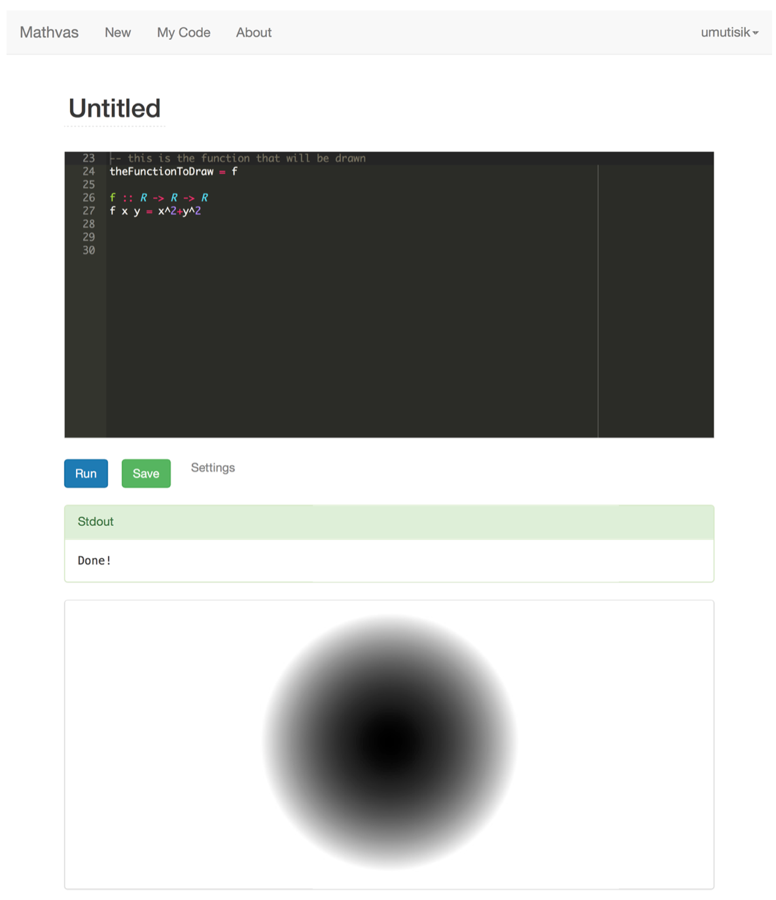
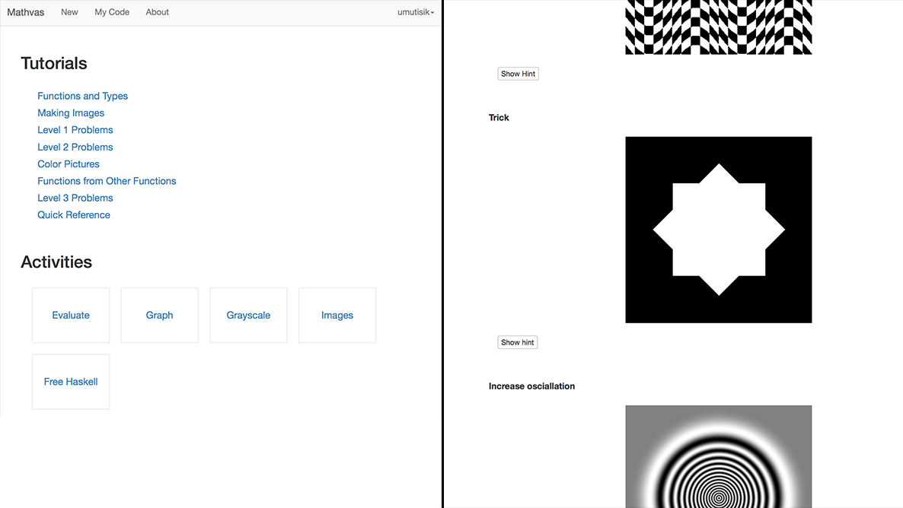

Mathvas
=======

[mathvas.com](http://www.mathvas.com). A programming and mathematical art workshop in Haskell. Based on [glot.io](https://www.glot.io). Used with UCI undergraduates and the [UCI Math Circle](https://www.math.uci.edu/~mathcircle/).  

* Students write Haskell code, special modes for producing grayscale and color images from functions R^2 -> R and R^2 -> R^3. 
* Code is compiled and run in Docker containers server-side
* Includes tutorials and exercises written in markdown plus custom hide/show button for answers to problems. 

### Screenshots

---

## Contributing
This web applcation uses the Yesod Framework and is deployed using Keter. Please get in touch if you need any help getting started.

