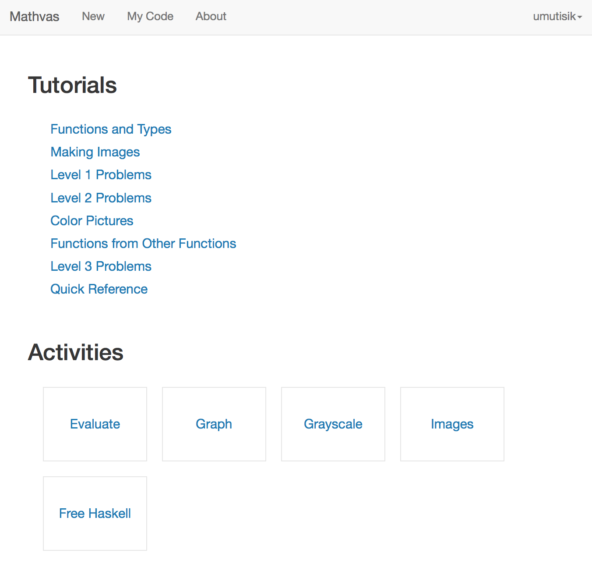
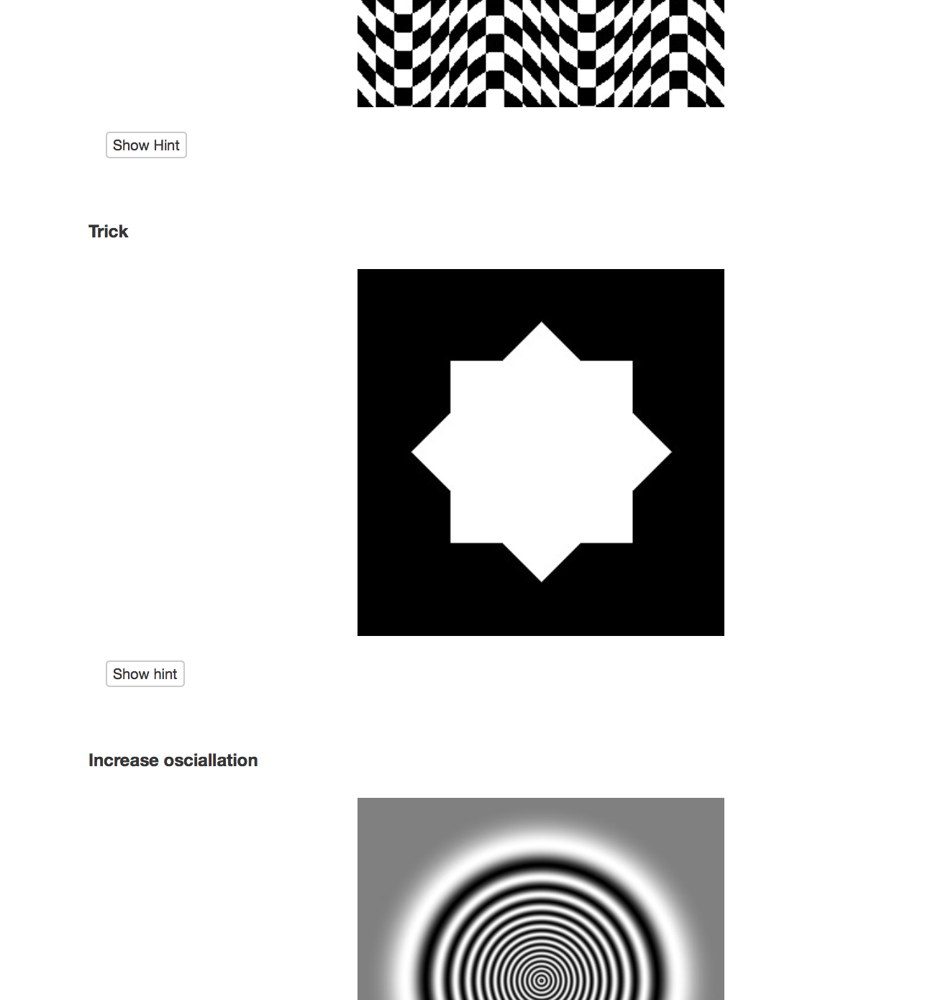

Mathvas
=======

[mathvas.com](http://www.mathvas.com). A programming and mathematical art workshop in Haskell. Based on [glot.io](https://www.glot.io). Used with UCI undergraduates and the [UCI Math Circle](https://www.math.uci.edu/~mathcircle/).  

* Students write Haskell code, special modes for producing grayscale and color images from functions R^3 -> R or R^3 -> R^2
* Code is compiled and run in Docker containers server-side
* Includes tutorials and exercises written in markdown plus custom hide/show button for answers to problems. 

### Screenshots

